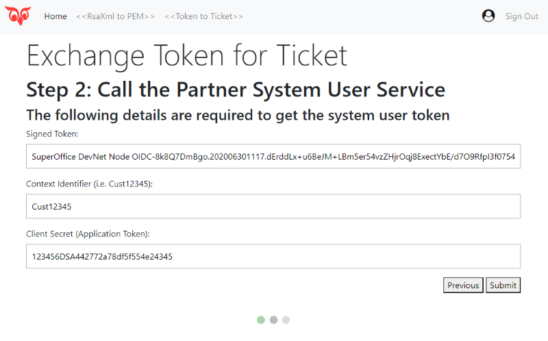
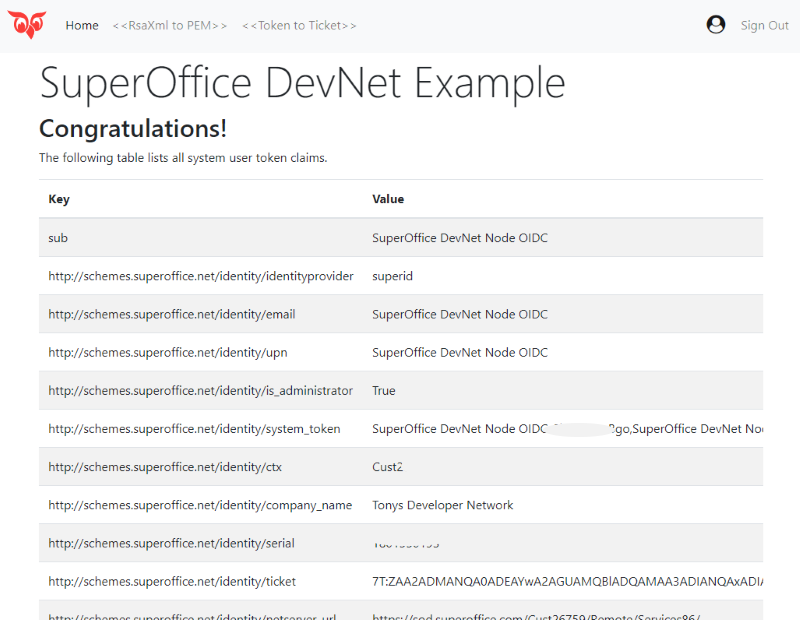

# SuperOffice Developer Network

Getting Started:

1. Download or clone the repo and open in favorite code editor
1. Modify the `.env` file and specify your client_id and client_secret.
1. Run `npm install`
1. Run `npm run` or `npm run dev` to start the web site.
1. Navigate to `http://localhost:3300` to view the web site.
1. IF USING SIGNIN FEATURE: make sure your app has whitelisted this redirect:
   `http://localhost:3300/openid/callback`

This examples web site uses NodeJs and Express to demonstrate two functions:

1. How to convert RSA XML to RSA PEM
1. How to use RSA key and System User Token to call Partner System User Service SOAP endpoint to obtain a system user ticket.

Note of Interest:

* Web site can be used both with and without first signing into SuperID.

* Signing into SuperID is beneficial in a couple ways:
  * Display own users JWT details (claims)
  * Save a few keystrokes for populating the System User Token field and context identifier.

* Demonstrates how to use the JWKS endpoint to validate the returned security token.

The benefits when signed in are:

## Web Site Use

### Convert RSA XML to RSA PEM

On this page, you can either 

1. Paste in an RSA key and tab out, or
1. Use the Browse button to open your private RSA XML file.

Afterwards the Convert button will appear. Click the Convert button to convert the RSA key from XML to PEM format. 

When converted, Download PEM and Forward PEM buttons are displayed.

Use the download button to permanently save the PEM format to your drive.

Use the forward button to send your PEM key to the Exchange System User token page. This is more of a convenience feature.

### Exchange System Token for Ticket

This is a wizard driven approach to signing a system user token, and then using it to obtain a system user ticket.

### Step 1: Specify the System User Token and Private Key. 

Note that if you signed in, and you are an admin user, this value will be populated for you.

### Step 2: Use Signed Token and Invoke SOAP Endpoint

To invoke the SOAP PartnerSystemUserService endopint, to get back the System User Ticket, you must specify the tenants context identifier and your applications secret token.

The context identifier must be the owner of the system user token, used in step 1.

The application token must belong to an application with prior access approval.

## Step 3: The Result

If successful, the final page lists all claims in the returned security token, including the system user ticket.

I hope this application has been helpful!
