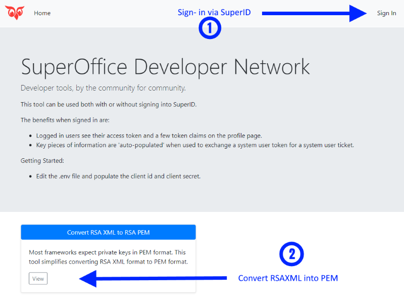

# SuperOffice Developer Network

Live version of this application: https://devnet-tools.superoffice.com

Getting Started:

1. Download or clone the repo
1. Open in favorite code editor
1. In the repo folder run `npm install`
1. Run `npm run` or `npm run dev` to start the web site.
1. Navigate to `http://localhost:3300` to view the web site.

> [!NOTE]
> For sign-in, make sure your app has whitelisted this redirect URL: `http://localhost:3300/openid/callback`

This examples web site uses NodeJs and Express to demonstrate two functions:

1. how to convert RSA XML to RSA PEM
1. how to use RSA PEM to sign your System User Token and call the System User Service to obtain a system user ticket

**When not signed-in.**

**When signed-in.**

---

**Note of Interest**:

* Web site is best used when signed in.

* Signing into SuperId is beneficial in a couple ways:
  * display own users JWT details (claims)
  * save keystrokes when populating fields

* Demonstrates how to use the JWKS endpoint to validate the returned security token.

## Web Site Use

### Convert RSA XML to RSA PEM

On this page, you can either

1. paste in an RSA key
1. use the **Browse** button to open your private RSA XML file

Afterwards the Convert button will appear. Click the Convert button to convert the RSA key from XML to PEM format.

When converted, both the Download PEM and Forward PEM buttons are displayed.

Use the download button to permanently save the PEM format to your drive.

Use the forward button to send your PEM key to the **Token to Ticket** page. This is more of a convenience feature.

---

### Exchange System Token for Ticket

This is a wizard driven approach to signing a system user token, and then sending it to the SystemUserService endpoint to obtain a system user JWT. The system user JWT contains a system user ticket claim.

#### Step 1: Specify the System User Token and Private Key.

Note that if you signed in, and you are an admin user, this value will be populated for you.

#### Step 2: Use Signed Token and Invoke SOAP Endpoint

To invoke the SOAP PartnerSystemUserService endpoint, you must specify the tenants context identifier and your applications secret token. This is filled in for you automatically.

The application token must belong to an application with prior access approval.

#### Step 3: The Result

If successful, the final page lists all claims in the returned security token, including the system user ticket.

I hope this application has been helpful!

