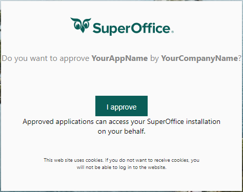
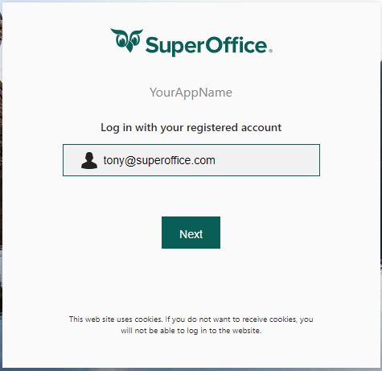
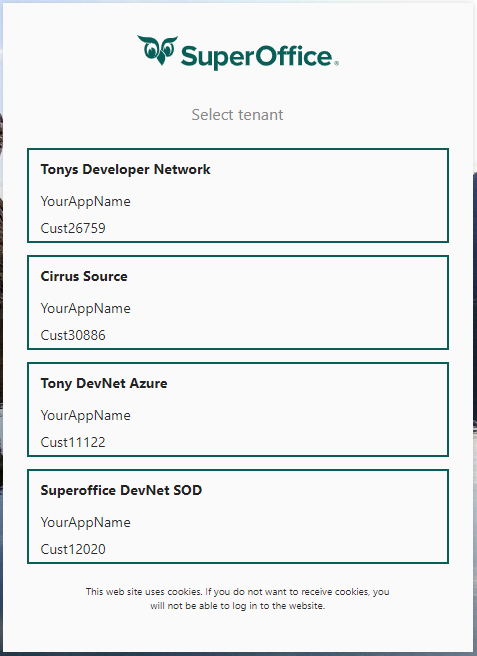
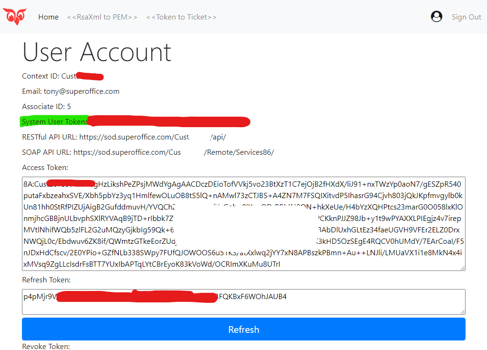

# Private applications

## Helper for private applications

Most custom (private) applications struggle getting started due to the bare minimum requirements.

The biggest hurdles most private applications have include:
  
* understanding the requirement to conduct an interactive installation
* setup a web site to handle the redirect URL

### Required interactive installation

Even private applications must be granted permission to access tenant resources. Therefore, just like when a tenant administrator installs a public application from the SuperOffice appstore, private applications must also perform an interactive login sequence to prompt the user with the `Approval` page.

This login sequence is expected to be performed by the private application. Historically this step has required that you understand how to create a web application configured to authenticate using OpenID Connect.

Sometimes it may seem unnecessary, even overwhelming, to build a web site *just* to authenticate with OpenID Connect. However, it's the only way to establish an authorization contract between your private application and the tenant installation.

Nearly all private applications perform their tasks using non-interactive server-to-server communication, and therefore require the system user security token to do so. Because the `system user token` is only generated during the approval process, the only way to get this token is by receiving the id_token at the applications' redirect URL.

### Handle redirect URL

As stated in the previous section, an interactive installation sequence is performed using an OpenID Connect authentication flow. Once authentication is successful, the approval page presented. When you click `I approve`, SuperOffice generates three OpenID Connect tokens and sends those back to your registered redirect URL. The three tokens are:

* id_token
* access_token
* refresh_token

Contained in the **id_token** is the `system user token`. This claim is necessary to carry out non-interactive server-to-server communications.

The id_token is a base64 encoded JSON Web Token (JWT), signed by SuperOffice when generated. While it is easy to decode it and extract the claims within, it's recommended you validate the token to certify it has not been tampered with during transit.

Both the token validation and claim extraction adds additional layers of complexity *just* to build a private application. To help you get started faster, we have created a sample application that circumvents the above requirements.

### Introducing devnet-tokens

We have [published a web application](https://devnet-tokens.azurewebsites.net) that will help consultants get over the initial hurdles for building private online customizations.

First created as an OpenID Connect/PassportJS code sample, the [source code](https://github.com/SuperOffice/node-express-convert-certs-and-sys-token) has evolved to make it easy for private applications to easily overcome the basic requirements.

All you need to do is navigate to it online and **select** Sign In.

 On the next page, select your target environment and supply your applications client_id and client_secret, then **select** Sign in.

You are redirected to SuperOffice SuperID for authentication. Enter your username, then **select** Next.

Once authentication is successful, one of two things will appear. 

If your SuperID user is associated with multiple tenants, you will first be presented with a tenant selection screen. **Select** the tenant you wish to associate with this client_id (private application).

You are shown the Allow page. **Select** `I approve` to continue.

Finally, you will be redirect to the devnet-tokens account page where you may collect the system user token.

This application is also useful when you want an fast way to get an access token and, using your favorite REST client, start to making REST calls to your tenant web api REST web services.

Another useful feature of this application, is the possibility to convert an RSA XML file into the PEM format. This is a common certificate format used for platforms such as NodeJS and PHP.

When signed in, you can use the `Token to Ticket` wizard to sign your system user token and send that off to SuperOffice to obtain a system user ticket credential. This doesn't really have any practical benefits, but is included in the sample application source code for NodeJS demonstration purposes.

We also have samples that demonstrate how to exchange a system user token for a system user ticket in [.NET](https://github.com/SuperOffice/SuperOffice.DevNet.Online/tree/master/Source/SuperOffice.DevNet.Online.SystemUser.ServiceConsole), [.NET Core](https://github.com/SuperOffice/SuperOffice.DevNet.Online.SystemUser.NetCore.Console), [PHP](https://github.com/SuperOffice/devnet-php-oidc-soap) and [Python](https://github.com/SuperOffice/devnet-python-system-user).
